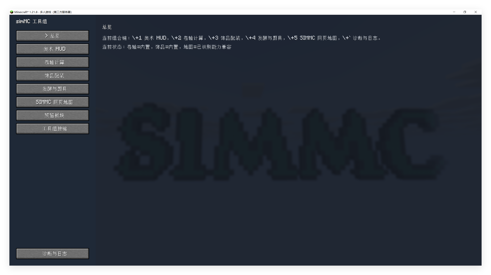
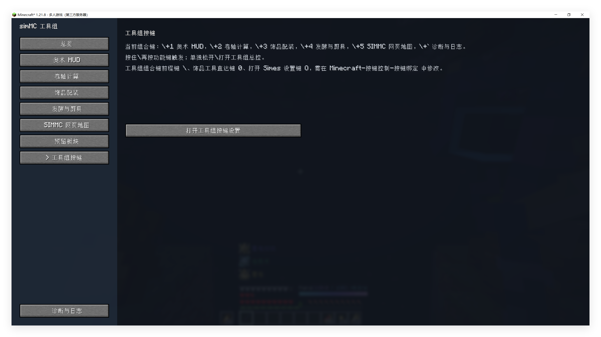
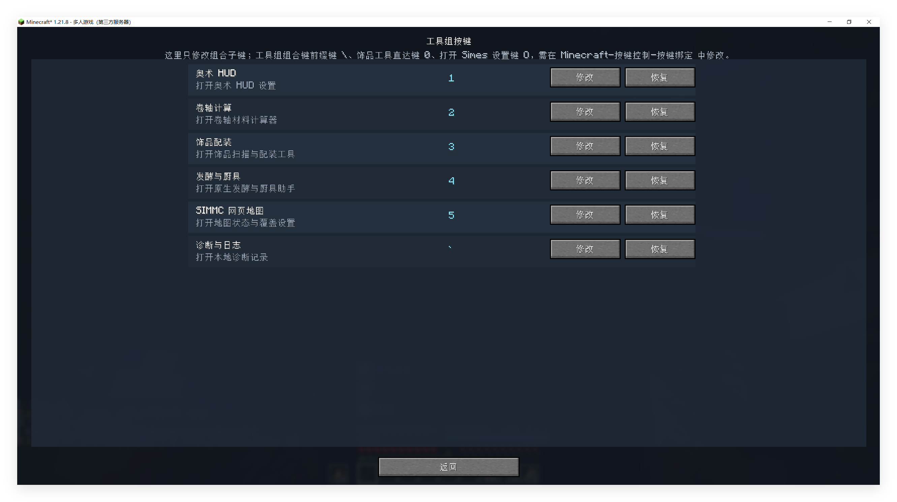
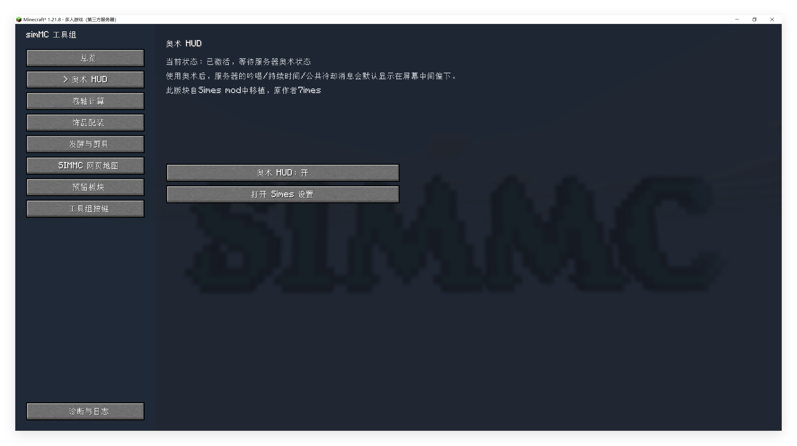
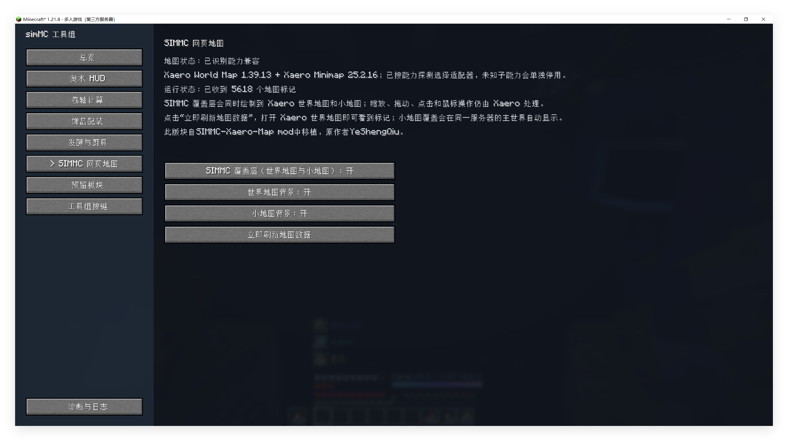

# simMC Tool Set

面向 simMC 玩家的 Minecraft 1.21.8 Fabric 客户端工具模组。simMC Tool Set 将多个本地工具合并为一个 mod、一个客户端入口和一个可配置的总控界面；只需安装在客户端，服务器无需安装。

[English](#english) · [最新正式版 1.1.7](https://github.com/MurphyPotato/simmc-tool-set/releases/tag/v1.1.7-fabric-mc1.21.8) · [问题反馈](https://github.com/MurphyPotato/simmc-tool-set/issues)

## [最新正式版-直接下载链接]
[simMC Tool Set ver.1.1.7](https://github.com/MurphyPotato/simmc-tool-set/releases/download/v1.1.7-fabric-mc1.21.8/simmc-tool-set-fabric-1.1.7-fabric-mc1.21.8.jar)

## 主要功能

- **奥术 HUD**：奥术冷却条、吟唱与持续状态、公共冷却、法杖魔力 HUD；支持 Simes HUD 与原版 Action Bar 显示模式，以及独立开关和位置/缩放调整。
- **发酵与厨具助手**：识别发酵桶、炖锅、蒸锅和煎锅，显示材料、数量、服务器校准时间、完成状态与厨具开盖状态。
- **饰品配装**：扫描当前物品栏或容器中的饰品，查看属性并计算配装方案。
- **卷轴计算**：计算奥术卷轴材料配比，支持材料排除和轮换方案。
- **SIMMC 网页地图**：在 Xaero 世界地图和小地图中显示 SIMMC 地图覆盖层、标记和背景；按能力探测 Xaero 版本，无法确认的覆盖功能会单独停用。地图数据来自公开的 `map.simmc.cn` 端点。
- **诊断与配置**：统一总控、动态快捷键、独立模块状态、配置迁移和本地诊断日志导出。

## 界面预览

### 总控与快捷键

### 奥术 HUD

### 工具模块

### 诊断日志

## 操作方式

### 原生按键

这些入口使用 Minecraft 原生按键绑定，可在“选项 → 控制 → 按键绑定”中修改、取消绑定或恢复默认：

| 默认键 | 功能 |
| --- | --- |
| `\` | 组合前缀；单独松开打开 Tool Set 总控 |
| `0` | 饰品工具直达 |
| `O` | Simes 设置入口（外置 Simes 存在时由外置模组接管） |

### Tool Set 组合子键

按住 `\` 后在短时间内按下子键：

| 子键 | 功能 |
| --- | --- |
| `1` | 奥术 HUD |
| `2` | 卷轴计算 |
| `3` | 饰品配装 |
| `4` | 发酵与厨具 |
| `5` | SIMMC 网页地图 |
| `` ` `` | 诊断与日志 |

组合子键只在 Tool Set 的按键设置页修改，绑定会保存到 `config/simmc-tool-set/shortcuts.properties`。文本输入、聊天、容器交互和普通数字快捷栏操作不会被拦截。

## 安装

需要 Minecraft `1.21.8`、Java `21`、Fabric Loader `0.17.3` 或更高版本，以及兼容 Minecraft 1.21.8 的 Fabric API（项目测试版本为 `0.136.1+1.21.8`）。下载 [v1.1.7 JAR](https://github.com/MurphyPotato/simmc-tool-set/releases/download/v1.1.7-fabric-mc1.21.8/simmc-tool-set-fabric-1.1.7-fabric-mc1.21.8.jar) 放入目标客户端的 `mods` 文件夹。Xaero 世界地图和小地图是可选依赖；现代 Fabric JAR 已包含各自需要的 XaeroLib，不要另装重复的 XaeroLib。

v1.1.0–v1.1.6 是历史预发布版本，v1.1.7 是当前正式 GitHub Release。每个正式/候选 JAR 旁均提供 `.jar.sha256` 文件。

## 网络与隐私

simMC Tool Set 不包含遥测、广告或自动上传。网页地图模块会按需从公开 `map.simmc.cn` 读取地图设置、标记、玩家和瓦片数据，并在本地缓存；其他工具主要处理客户端已经可见的数据。地图请求可能包含公开地图服务所需的网络地址和标准缓存请求头，不会向作者上传个人数据。

## 许可

原创代码和文档按 [MIT License](LICENSE) 发布。Simes、Xaero 及其他第三方组件遵循各自的许可证和声明，详见 [THIRD_PARTY_NOTICES.md](THIRD_PARTY_NOTICES.md)。

本项目由 MurphyPotato 制作，与 simMC、Mojang Studios 或 Microsoft 无官方关联。

## English

simMC Tool Set is a client-side utility mod for Minecraft 1.21.8 Fabric. It combines the Arcane HUD, fermentation and cookware helper, accessory loadout tool, scroll calculator, SIMMC web-map integration, diagnostics, and configurable shortcuts in one client mod.

Install the v1.1.7 JAR in the client `mods` folder. The mod requires Java 21, Fabric Loader 0.17.3+, and Fabric API compatible with Minecraft 1.21.8. Xaero's World Map and Minimap are optional; modern Fabric Xaero jars include their required XaeroLib internally.

The map module reads public map data from `map.simmc.cn` when enabled. It does not include telemetry, advertising, automatic uploads, or runtime generative AI. See [THIRD_PARTY_NOTICES.md](THIRD_PARTY_NOTICES.md) for licensing details.
