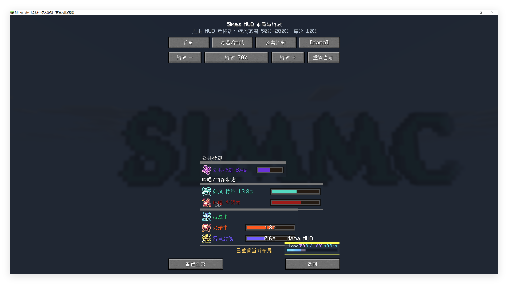
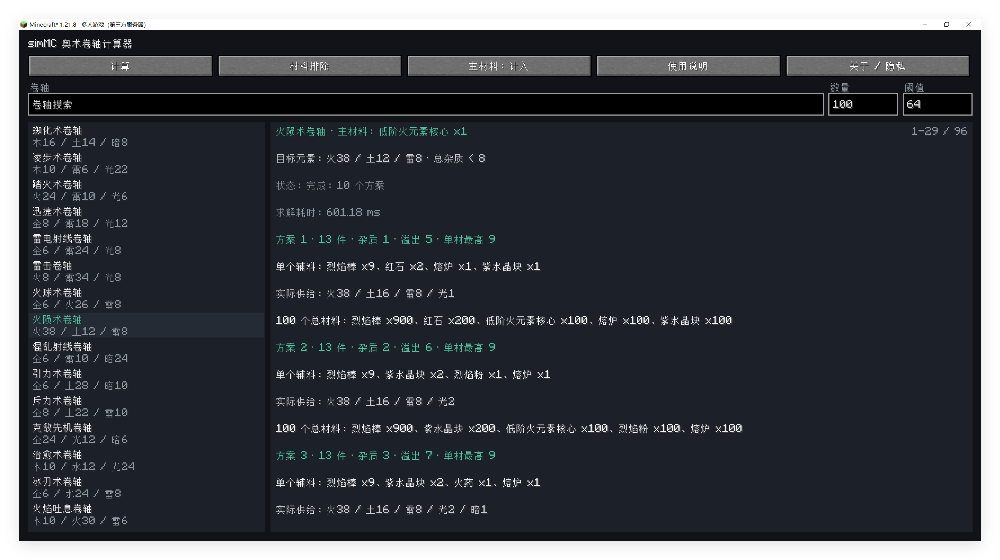
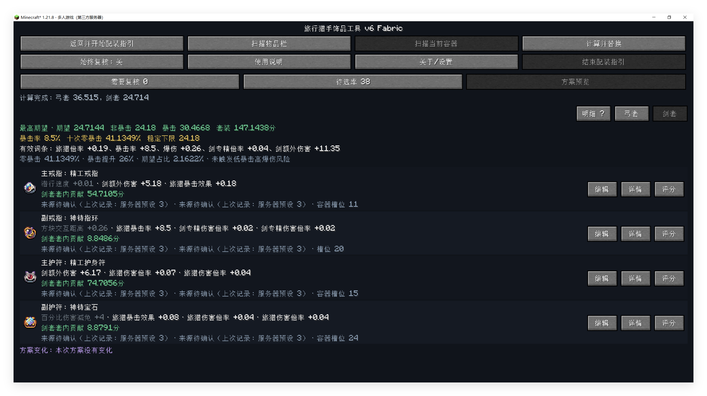
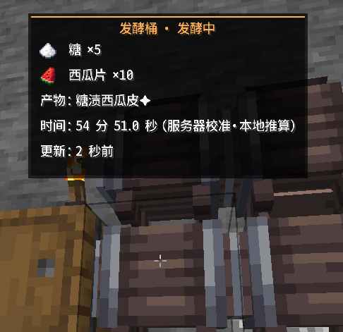
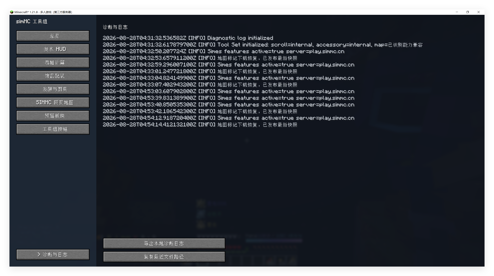

# simMC Tool Set

面向 simMC 玩家的 Minecraft 1.21.11 Fabric 客户端工具模组。只需安装在客户端，服务器无需安装。

## 当前版本

- **正式版 v1.2.0**：基于 1.1.9-dev.20260915.1，包含卷轴衰减计算与方案规划、社区致谢页、统一问题反馈入口，以及奥术 HUD、饰品配装、发酵与厨具和诊断模块。
- **历史稳定版 v1.1.8**：升级到 Minecraft 1.21.11，并移除网页地图/Xaero 模块。

## 下载

- [v1.2.0 正式版](https://github.com/MurphyPotato/simmc-tool-set/releases/tag/v1.2.0-fabric-mc1.21.11)
- [v1.1.8 稳定版](https://github.com/MurphyPotato/simmc-tool-set/releases/tag/v1.1.8-fabric-mc1.21.11)

## 主要功能

- **奥术 HUD**：显示奥术冷却、吟唱/持续状态、公共冷却和法杖 Mana。
- **卷轴计算**：计算卷轴材料配比，支持材料排除、杂质和批量建议。
- **饰品配装**：扫描饰品、人工复核并计算剑套和弓套配装。
- **发酵与厨具**：识别发酵桶和锅具，显示材料、数量、计时与状态。
- **诊断与日志**：本地查看和导出诊断信息。

## 模块截图

### 奥术 HUD

- 显示奥术冷却、吟唱/持续状态、公共冷却和法杖 Mana

- 支持模块化自定义HUD位置和大小

### 卷轴计算

- 根据目标卷轴种类和数量，自动计算合成方案

- 基于玩家群体研究，实装元素衰减机制对合成方案的影响

- 支持材料排除、杂质和组合方案

- 支持组合方案，自定义合成方案，从历史记录收藏常用合成方案

### 饰品配装

- 扫描饰品，无论其在饰品栏，物品栏，背包，还是容器中

- 自动入库被扫描的饰品，并自动计算伤害评分

- 自动按最佳期望伤害计算剑套和弓套配装，并提供配装引导，帮助玩家定位最佳饰品位置
  - 红框代表剑套最佳饰品，蓝框代表弓套最佳饰品

- 当前支持旅猎套装

### 发酵与厨具

- 本地化记录发酵桶的放入物品，当前发酵剩余时间（需要通过烹饪时钟同步）

- 本地化记录（御三锅）煎锅、蒸锅、煮锅的放入物品，以高亮发光区别显示当前烹饪状态
  - 不发光：啥都没放
  - 红光：你菜变碳了
  - 蓝光：放入材料但还没开始烹饪
  - 黄光：正在烹饪
  - 绿光：烹饪完成

### 诊断与日志

- 出bug时请导出mod诊断日志与游戏log，然后发送issue，不胜感激。

## 安装

目标环境：Minecraft `1.21.11`、Java 21、Fabric Loader `0.19.5`、Fabric API `0.141.6+1.21.11`。将对应 JAR 放入客户端 `.minecraft/mods`。
本mod为客户端mod。

## 网页地图

从 v1.1.8 起，Tool Set 不再支持 SIMMC 网页地图、Xaero 适配、地图 HTTP 下载、地图缓存和地图快捷键。

如需要原功能，请去simmc官方kook 规则帮助与资源下载 频道，下载 simmc-map-addon 模组。

## 致谢

- 奥数卷轴计算模块中，所使用的核心计算过程和基础数据均基于玩家社区对奥数卷轴合成模式的自发探索。
  - 感谢玩家 PeterPG_ 贡献了对于《元素衰减机制》的研究，并提供了完整计算公式。同时TA也在本模块迭代期间参与了对于本模块实际采用的 “元素衰减机制” 的核验工作。
  - 感谢玩家 JeanBH 贡献了对于《物品-元素含量对照表》的研究，并提供了完整表格。同时TA也在本模块迭代期间参与了对于本模块实际采用的《物品-元素含量对照表》的核验工作。

- 本模组 奥术HUD 模块和 发酵与厨具 模块原先均移植自玩家 7imes 的模组 Simes Mod。当前 Simmc tool set mod 中，基于 Simes 原有模块进行了优化，修复了原版对应模块在使用过程中的一些bug，并且增加了一些功能。
  在此感谢玩家 7imes 对于修改 Simes Mod 的许可与授权。

- 本模组制作过程中得到了很多玩家的帮助。感谢以下玩家在本模组测试过程中提出的宝贵意见和建议：
    Fei_Ge56 Gulanan INTIMES kwpog MingXue_ SnMeow WolfSoul2024 Yanweny （以上排名不分先后）。

## 许可

原创代码和文档使用 [MIT License](LICENSE)；第三方来源和授权见 [THIRD_PARTY_NOTICES.md](THIRD_PARTY_NOTICES.md)。
